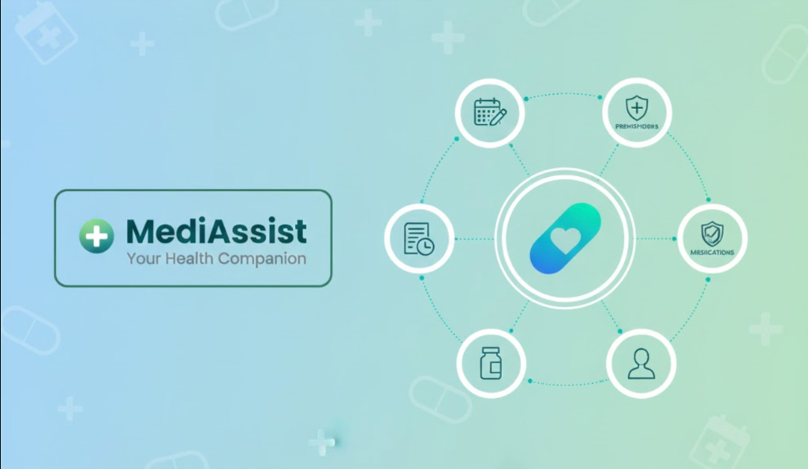
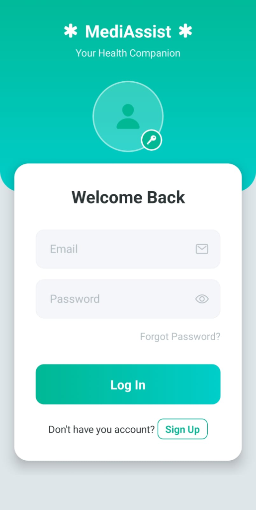
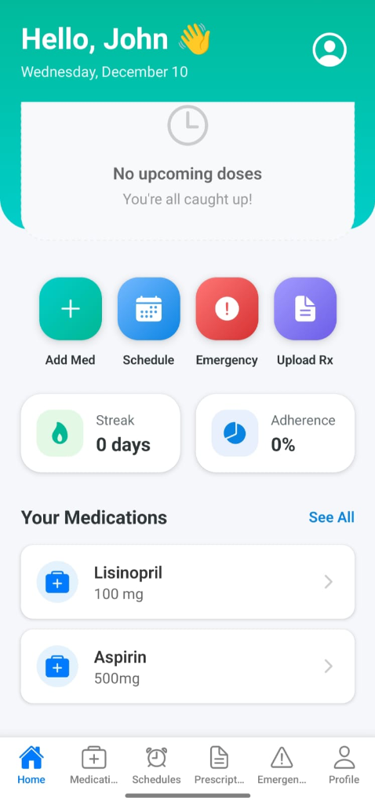
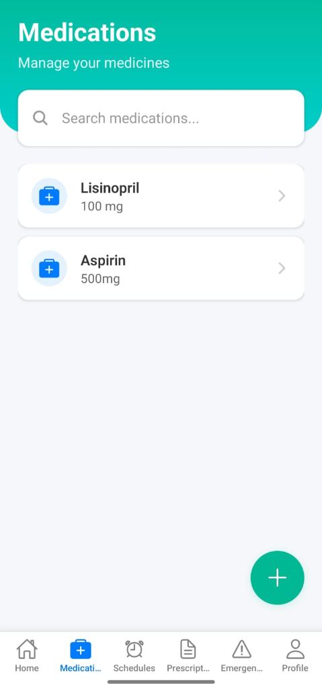
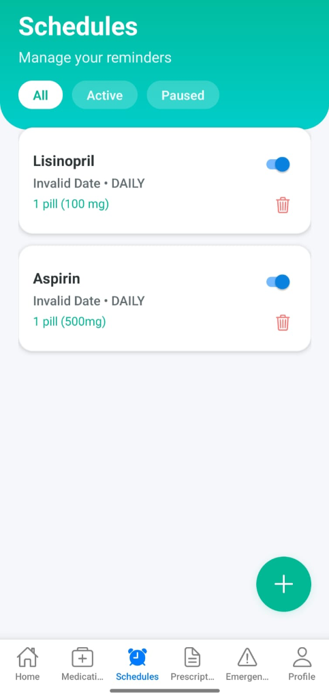
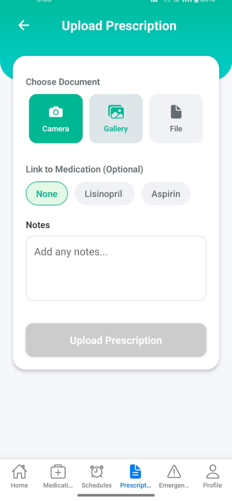
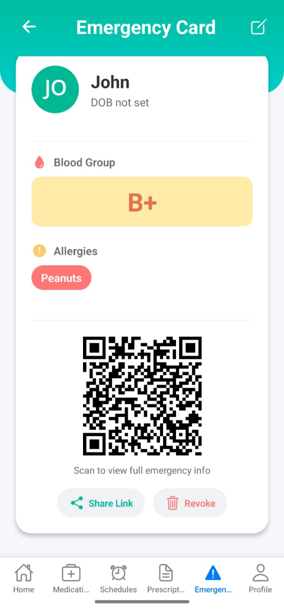

# 🏥 MediAssist – Digital Health Companion

<div align="center">

  
  
  

  ### Your Health Companion

  

</div>

---

## 📖 Table of Contents
- [About the Project](#-about-the-project)
- [Problem & Solution](#-problem--solution)
- [Key Features](#-key-features)
- [Tech Stack](#-tech-stack)
- [Watch Live Demo](#-watch-live-demo)
- [Screenshots](#-screenshots)
- [Installation & Quick Start](#-installation--quick-start)
- [Folder Structure](#-folder-structure)
- [Roadmap](#-roadmap)
- [Future Scope](#-future-scope)
- [Author](#-author)

---

## 📝 About the Project

**MediAssist** is a personal health and medicine management application designed to simplify the daily management of medications, prescriptions, and emergency health details. It serves as a centralized digital companion to ensure you never miss a dose and have critical health information readily available.

---

## ❓ Problem & Solution

### The Problem
Managing daily medicines, prescriptions, and emergency health details is difficult for many people. Common issues include:
*   ⏰ **Forgetting** to take medicines on time.
*   📋 **Scattered Prescriptions** across different places.
*   😓 **No Central Space** to track medicine schedules.
*   🚨 **Emergency Info** not instantly available during critical moments.

### The Solution
MediAssist solves these challenges by providing:
*   📲 Easy medicine scheduling and reminders.
*   🗂️ Digital storage for prescriptions.
*   📡 QR-based emergency health card for instant access.
*   🔐 Secure authentication and offline accessibility.

---

## 🌟 Key Features

*   **💊 Medicine Reminders & Schedules**: Create and manage medicine timings, dosage, and frequency so you never miss a dose.
*   **📂 Digital Prescription Storage**: Upload and view prescription images directly in the app.
*   **🚨 Emergency Health Card (QR Code)**: Generate a QR code containing vital info like blood group and allergies for first responders.
*   **🔐 Secure & Private**: User registration and login are protected with encrypted authentication (JWT).
*   **📈 Adherence Tracking**: Mark doses as “Taken” or “Missed” to track your consistency.
*   **🔔 Smart Notifications**: Receive push notifications for your scheduled medicines.

---

## 🛠️ Tech Stack


---

## 🎥 Watch Live Demo

Check out the video demonstration of MediAssist:

[](https://youtu.be/uRFzKoYXyJc)


---

## 📱 Screenshots

| **Login Screen** | **Dashboard** | **Medications** |
|:---:|:---:|:---:|
|  |  |  |

| **Schedules** | **Upload Prescription** | **Emergency Card** |
|:---:|:---:|:---:|
|  |  |  |

---

## 🚀 Installation & Quick Start

### Prerequisites
*   Node.js installed
*   npm or yarn
*   PostgreSQL database setup

### Steps

1.  **Clone the repository**
    ```bash
    git clone https://github.com/Divyapahuja31/MediAssist.git
    cd MediAssist
    ```

2.  **Setup the Backend**
    ```bash
    cd backend
    npm install
    # Set up your .env file with DB credentials
    npm run dev
    ```

3.  **Setup the Frontend**
    ```bash
    cd frontend
    npm install
    npm start
    ```

---

## 📂 Folder Structure


```
MediAssist/
├── backend/
│   ├── prisma/             # Database Schema & Migrations
│   ├── src/
│   │   ├── config/         # Environment & DB Configs
│   │   ├── middlewares/    # Custom Middlewares
│   │   ├── modules/        # Feature-based Architecture
│   │   ├── services/       # External Services (Storage, Push)
│   │   └── utils/          # Utility Functions
│   ├── index.js            # Server Entry Point
│   └── package.json
│
├── frontend/
│   ├── assets/             # Static Assets (Images, Icons)
│   ├── src/
│   │   ├── api/            # API Service Layer
│   │   ├── components/     # Reusable UI Components
│   │   ├── context/        # Global State Management
│   │   ├── navigation/     # App Navigation
│   │   ├── screens/        # UI Screens
│   │   └── utils/          # Support Functions
│   ├── App.js              # Main Application Component
│   └── package.json
│
└── README.md
```

---

## 📅 Roadmap

*   **Week 1–2:** Research & UI/UX Design ✅
*   **Week 3–4:** Backend & Database Setup 🏗️
*   **Week 5–6:** Core Features Implementation 🚧
*   **Week 7:** Testing & Bug Fixes 🐛

---

## 🔮 Future Scope

*   **AI-Driven Insights:** Personalized health tips based on medication history.
*   **Wearable Integration:** Sync with smartwatches for real-time health monitoring.
*   **Doctor Consultation:** In-app booking for doctor appointments.
*   **Drug Interaction Check:** Warning system for harmful medicine combinations.

---

## ✍️ Author

**Divya Pahuja**

*   GitHub: [@Divyapahuja31](https://github.com/Divyapahuja31)